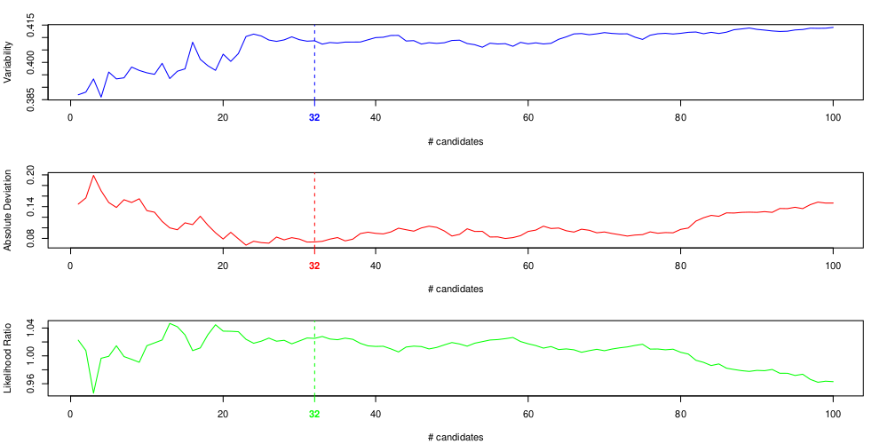

# Defining a set of stable genes from an RNA-Rx dataset

A procedure to determine a set of genes with stable expression between different conditions from a spike-in RNA-seq (RNA-Rx).

*Method and algorithms by Geoffrey Schivre, adapted to R and documented by Adrien Vidal.*

*Published in:
_Genome-scale transcriptome augmentation during Arabidopsis thaliana photomorphogenesis
Geoffrey Schivre, Léa Wolff, Filippo Maria Mirasole, Elodie Armanet, Mhairi L. H. Davidson, Adrien Vidal, Delphine Cuménal, Marie Dumont, Mickael Bourge, Célia Baroux, Clara Bourbousse, Fredy Barneche
 bioRxiv 2025.01.30.635720; doi: https://doi.org/10.1101/2025.01.30.635720_*

The studied organism is later noted as the principal organism and the exogenous organism used for normalization as the spike-in organism.

Required files:

* `FASTQ` files containing the raw reads.
  * May be compressed as a `.gz` archive.
  * In the case of paired-end sequencing, two files per sample with matching read IDs are needed.
* `FASTA` file of the principal organism's reference genome.
* `FASTA` file of the principal organism's transcripts.
* `FASTA` file of the spike-in organism's genome.
* `FASTA` file of the spike-in organism's transcripts.
* `BED` file of the mRNA encoding genes for the principal organism (genes_principal.bed).
* `BED` file of the mRNA encoding genes for the spike-in organism (genes_spikein.bed).
    * The $4^{th}$ column of those `BED` files must contain the gene IDs.
    * A `BED` file can be produced from a `GFF` annotation using the [bedFromGff.pl](bedFromGff.md) script.
* A transcript-to-gene correspondence table for the principal organism (tx2gene_principal.tsv)
* A transcript-to-gene correspondence table for the spike-in organism (tx2gene_spikein.tsv)
    * These tables are two-column tabulated files reporting the gene ID for each transcript ID (example below).
    * This information can be extracted from a `GFF` file using the [tx2GeneFromGff.pl](tx2GeneFromGff.md) script.


## 1) <a id="salmonindexing">salmon index</a>

This step is necessary for `salmon` [quantification](#salmon). It is only needed the first time as the index files created by this tool can be used for any subsequent analyses with the same combination of principal and spike-in transcripts.

Combine the transcripts `FASTA` files of both the principal and spike-in organisms and index them with `salmon index`.
To improve `salmon`'s mapping, genome assembly sequences of both organisms can be provided as a decoy by merging the assembly `FASTA` files with the transcripts `FASTA` files and recording the identifiers of the genomic sequences in a separate file.
When merging genome assemblies, adding an extra tag to the spike-in sequence IDs may be necessary if the chromosomes are labeled similarly.
A k-mer length (`-k`) of 31 is recommended for reads longer than 75bp.

```shell
# concatenate transcript sequences of both organisms
cat transcripts_principal.fasta transcripts_spikein.fasta > transcripts_principal+spikein.fasta

# concatenate genome sequences of both organisms and add a tag to the spike-in chromosome names
cat genome_principal.fasta <(cat genome_spikein.fasta | sed "s/>/>$SPIKE_IN_TAG/") > genome_principal+spikein.fasta

# create a text file with the chromosome names of both organisms that will reference the decoy
grep '>' genome_principal+spikein.fasta | sed "s/>//" > salmon_decoy.txt

# concatenate the sequences of genomes and transcripts of both organisms
cat transcripts_principal+spikein.fasta genome_principal+spikein.fasta > transcripts+genome_principal+spikein.fasta
```

#### **Indexing**
A k-mers length (`-k`) of 31 is recommended for reads longer than 75bp.

```shell
salmon index -k 31 \
    -t transcripts+genome_principal+spikein.fasta \
    -i salmon_index/ \
    -d salmon_decoy.txt \
    -p $THREADS \
    --tmpdir tempDir/
```

## 2) <a id="salmon">Read counts on genes with salmon</a>

The [salmon](https://salmon.readthedocs.io/en/latest/salmon.html) `quant` command estimates the share of reads corresponding to each transcript. We can use the options for sequence (`--seqBias`) and GC (`--gcBias`) bias correction.
* `-i` points to the [index](#salmonindexing)
* `-l` indicates the library type as explained [here](https://salmon.readthedocs.io/en/latest/salmon.html#what-s-this-libtype)
* `-r` is used for single-end alignment, while `-1` and `-2` are used to indicate the two `FASTQ` read file(s) of a paired-end sequencing
* `--numGibbsSamples`: number of replicates to use in the Gibbs sampling to estimate the variance in the abundance estimates (we use 100)
* `--thinningFactor`: number of steps to discard for every sample kept from the Gibbs chain (using a factor of 100 for 100 Gibbs replicates means 10,000 will be generated)

**Example single-end salmon alignment command:**
```shell
salmon quant -l SF \
  -i salmon_index/ \
  -r sample.trimmed.fastq.gz \
  -o sample_quant/ \
  -p $THREADS
  --seqBias --gcBias \
  --numGibbsSamples 100 --thinningFactor 100 \
```

**Example paired-end salmon alignment command:**
```shell
salmon quant -l ISF \
  -i salmon_index/ \
  -1 sample_1.trimmed.fastq.gz \
  -2 sample_2.trimmed.fastq.gz \
  -o sample_quant/ \
  -p $THREADS
  --seqBias --gcBias \
  --numGibbsSamples 100 --thinningFactor 100 \
```

## 3) Import data in R

The procedure is continued with R.

### 3.1) Import and merge the BED files of the mRNA encoding genes of both organisms

```R

table.genes.principal <- structure(
    read.table("genes_principal.bed"),
    names = c("chrom", "chromStart", "chromEnd", "name", "score", "strand")
)

table.genes.spikein <- structure(
    read.table("genes_spikein.bed"),
    names = c("chrom", "chromStart", "chromEnd", "name", "score", "strand")
)

table.genes <- data.frame(
    rbind.data.frame(
        table.genes.principal,
        table.genes.spikein
    ),
    organism = c(
        rep("principal", nrow(table.genes.principal)),
        rep("spikein", nrow(table.genes.spikein))
    )
)
```

### 3.2) Import and merge transcripts-to-gene correspondence tables of both organisms

Afterward, we need to process the Salmon outputs (the `quant.sf` file in the respective output folder for each sample) in `R` using the [tximport](https://bioconductor.org/packages/release/bioc/html/tximport.html) library.
Transcript quantification is transformed into gene quantification using a transcript-to-gene table containing transcripts of both principal and spike-in organisms.

**Combining the transcript-to-gene tables of both organisms:**
```R

table.tx2gene.principal <- structure(read.table("tx2gene_principal.tsv", header=FALSE), names = c("transcript", "gene"))

table.tx2gene.spikein <- structure(read.table("tx2gene_spikein.tsv", header=FALSE), names = c("transcript", "gene"))

table.tx2gene <- rbind.data.frame(
    table.tx2gene.principal,
    table.tx2gene.spikein
)
```

**Example of a combined transcript to gene table:**
```
AT1G01010.1  AT1G01010
AT1G01010.2  AT1G01010
AT1G01010.3  AT1G01010
AT1G01020.11 AT1G01020
AT1G01020.13 AT1G01020
AT1G01020.14 AT1G01020
AT1G01020.15 AT1G01020
AT1G01020.16 AT1G01020
...
FBtr0114258	FBgn0085804
FBtr0302440	FBgn0039987
FBtr0347367	FBgn0267798
FBtr0347366	FBgn0267797
FBtr0302347	FBgn0058182
FBtr0445191	FBgn0267430
FBtr0345282	FBgn0266747
FBtr0345281	FBgn0266747
...
```
**Note:** The transcript-to-gene table (table.tx2gene) and the gene table (table.genes) must contain the same set of gene IDs. Some filtering may be required to ensure this.

### 3.3) Import `salmon` counts

The `scaledTPM` method for count estimation is used as advised in the `tximport` [vignette](https://bioconductor.org/packages/release/bioc/vignettes/tximport/inst/doc/tximport.html#Downstream_DGE_in_Bioconductor) to correct the gene length according to transcript isoform usage and summarize inferential replicates using the median instead of the mean.
The posterior median tends to be a better point estimate when the posterior is highly skewed, which is the case for the positively restricted transcript abundance estimates.
We set `varReduce =  FALSE` to obtain the inferential replicates' data.

**Example of processing with `tximport` (R):**
```R
library(tximport)

dirs.quant <- c("sample1_quant", "sample2_quant", ..., "sampleN_quant")

txi <- tximport::tximport(
  files = paste0(dirs.quant, "/quant.sf"),
  type = "salmon",
  tx2gene = table.tx2gene,
  countsFromAbundance = "scaledTPM",
  varReduce = FALSE,
  infRepStat = matrixStats::rowMedians
)
```

The `counts` matrix is obtained from the `txi` object and rearranged so that it matches the gene annotation table.
We discard the genes with no counts.

**Counts matrix**
```R
counts <- txi$counts

# Match counts rows to genes table:
ord <- match(table.genes$name, rownames(counts))
ord <- ord[!is.na(ord)]
counts <- counts[ord, ]

# Filter out rows with no counts:
counts <- counts[ apply(round(as.matrix(counts)), 1L, sum) > 0, ]
```

The following 3 vectors: `genes.ids` (id key to filter/order other tables), `genes.lengths`, and `organism` are used for further operations.
```R
genes.ids <- rownames(counts)
genes.lengths <- (table.genes$chromEnd - table.genes$chromStart)[ match(genes.ids, table.genes$name) ]
organism <- table.genes$organism[ match(genes.ids, table.genes$name) ]

```

The TPM counts are also saved, ordered and filtered to match the `counts` matrix.
**Transcipt-Per-Million (TPM) normalized counts:**
```R
tpm <- txi$abundance[genes.ids, ]
```

`txi$infReps` contains the inferential replicates' data. Its structure is, however, impractical. The data is rearranged into a three-dimensional array while ordering and filtering the genes according to `genes.ids`.

**Inferential replicates' counts**
```R
nb.genes <- nrow(counts)            # Number of genes
nb.samples <- ncol(counts)          # Number of samples
nb.gibbs <- ncol(txi$infReps[[1L]]) # Number of inferential replictes

infreps <- structure(
    array(dim=c(nb.genes, nb.samples, nb.gibbs)),
    dimnames=list(genes.ids, table.design$sampleId, 1L:nb.gibbs)
)
for( iGene in 1L:nb.genes ){
    which.gene <- which(rownames(txi$counts) == genes.ids[iGene])
    for( iSamp in 1L:nb.samples ){
        for( iGibbs in 1L:nb.gibbs ){
            infreps[iGene, iSamp, iGibbs] <- txi$infReps[[iSamp]][which.gene, iGibbs]
        }
    }
}
```

The `tximport` object can be deleted now to save memory.

```R
    rm(txi); invisible(gc())
```

### 3.4) Rescale inferential replicates

The `scaledTPM` option for `tximport` only applies this transformation to the `counts` matrix. The inferential replicate matrices must be manually rescaled to apply the same TPM normalization.

```R
med <- apply(infreps, 1L:2L, median)
infreps.scale <- counts / med
infreps.scale[med == 0] <- 1
rm(med) ; gc()

infreps.rescaled <- structure(
    array(dim=c(nb.genes, nb.samples, nb.gibbs)),
    dimnames=list(genes.ids, table.design$sampleId, 1L:nb.gibbs)
)
for( iGibbs in 1L:nb.gibbs ){
    infreps.rescaled[, , iGibbs] <- infreps.scale * infreps[, , iGibbs]
}
```

## 4) <a id="cate">Spike-in variability mitigation with CATE</a>

The use of a spike-in increases the variability of gene expression estimates. To mitigate this variability, we use a factor-augmented model with latent variables that will absorb the variability induced by non-observed confounders (see [Leek et al. 2012](https://www.ncbi.nlm.nih.gov/pmc/articles/PMC3307112/), [Risso et al. 2014](https://www.nature.com/articles/nbt.2931), [Wang et al. 2017](https://www.ncbi.nlm.nih.gov/pmc/articles/PMC6706069/)).
For this, the `cate` package estimates the latent factor and corrects the counts, which are then input to `DESeq2` for differential analysis.

### 4.1) Size factors estimation

We will first use `DESeq2` to estimate the size factors to apply to each sample using the counts over the spike-in genes.

The table describing the experimental design contains a unique name for each sample and as many variables as necessary to describe the samples (genotype, condition, replicate, etc.). Consider only adding a variable if there is a reason that it should contribute to the variability. For example, a `replicate` variable if there is a potential batch effect between replicate groups (samples within a group corresponding to the same plant seed lot, to an experiment done at the same time, etc.). Below is a design example to be adapted to the user's experimental design.
The experimental design table should have one row for each sample <ins>in the same order</ins> as the columns in the previously built counts matrix.

**Example experimental design table (R console output):**
```
sampleName  genotype    condition   replicate
WT_L_rep1   WT          Light       Rep1
WT_L_rep2   WT          Light       Rep2
mut_L_rep1  mut         Light       Rep1
mut_L_rep2  mut         Light       Rep2
WT_D_rep1   WT          Dark        Rep1
WT_D_rep2   WT          Dark        Rep2
mut_D_rep1  mut         Dark        Rep1
mut_D_rep2  mut         Dark        Rep2
...
```

An estimation of the size factors is made using DESeq2 on the spike-in gene counts:
```R
size.factors <- BiocGenerics::sizeFactors(BiocGenerics::estimateSizeFactors(
    suppressWarnings(DESeq2::DESeqDataSetFromMatrix(
        countData = counts[organism == "spikein"],
        colData = table.design,
        design = ~ genotype + condition + replicate
    ))
))
```

These size factors are centered on their geometric mean.
```R
size.factors <- size.factors / exp(mean(log(size.factors)))
```

### 4.2) Count correction

Genes with a count of zero reads in all samples are to be discarded. The count table is transformed using a log2 function to utilize `cate`. To prevent taking the log of 0, an offset of 0.5 is added to every count. The estimated size factors are applied to normalize the counts on the spike-in genes.

```R
genes.nonzero <- genes.ids[rowSums(counts) > 0]

counts.log <- sweep(log2( counts[genes.ids %in% genes.nonzero, ] + .5 ), MARGIN = 2, log2(size.factors), `-`)
```

The spike-in genes with at least 5 reads in each sample are selected as control genes. These genes will serve as normalization controls for which the biological variability is known to be null.
```R
genes.spikein.ref <- genes.ids[organism == "spikein" & apply(counts, 1L, min, na.rm=TRUE) > 5]
```

Variables that are considered to be "nuisance variables" should be separated from the rest to the right of the `"|"` character. The default behaviour of `cate` is to consider the intercept as a nuisance variable. 
RNAseq count data have no absolute scaling; therefore, the intercept should be kept as a nuisance variable to which other nuisance variables should be added. 
In this example, we consider that the `replicate` variable corresponds to a batch effect and should thus be treated as a nuisance variable. We indicate this by adding it to the right side of the formula: `| 1 + replicate`.

The `r` argument specifies the number of latent factors to estimate. Choosing a low r can retain some of the spike-in variability, while choosing a high r can lead to the removal of some biologically relevant variability. An `r` value of 1 is the most conservative choice. See the [note](#catefindr) below for an approach to finding the most appropriate value for `r`.

`counts.log` must be transposed so that the rows correspond to samples for the input of `cate`. The `%in%` operator produces the indices of the control genes within the `counts.log` table.

```R
library(cate)

cate.res <- cate::cate(
    formula = ~ genotype + condition | 1 + replicate,
    X.data = table.design,
    Y = t(counts.log),
    r = 1,
    fa.method = "esa",
    adj.method = "nc",
    nc = which(genes.nonzero %in% genes.spikein.ref), #Indices of reference genes in the filtered log counts table.
    nc.var.correction = FALSE,
    calibrate = FALSE
)
```

From the results, create a table of the corrected counts with:
$Z$: the estimated latent factors matrix
$\Gamma$: the estimated factor loadings matrix
$\vec{s}$: the DESeq2 estimated size factors.

Formula of the corrected count:
$$\LARGE{C'= \lceil 2^{ (log_{2}(C) - \Gamma \otimes Z)\vec{s} }-0.5\rfloor}$$

```R
counts.corrected <- round( sweep(2 ^ (counts.log - cate.res$Gamma %*% t(cate.res$Z)), MARGIN=2, size.factors, `*`) - 0.5, digits = 0 )
```

<a id="catefindr"></a>

**Note:** A way to find the most appropriate value for `r`:
* (1) Build a `DESeq2` model with size factors calculated on the raw gene counts of the principal organism only (`table.genes.principal`) and compute its [dispersion plot](#dispersion-plot).
* (2) Apply the first estimated size factors (`size.factors`) to that model using `BiocGenerics::sizeFactors(dds) <- size.factors`. Compute its [dispersion plot](#dispersion-plot). This dispersion should be higher than in (1).
* (3) Perform the `cate` correction with an `r` value of 1 until obtaining the `cate` corrected principal counts (`table.coverage.cate`) and the corresponding estimated size factors (`size.factors.cate`).
* (4) Build a `DESeq2` model (as [below](#model_building)) with the `cate` corrected principal counts (`table.coverage.cate`) and apply the corresponding estimated size factors (`size.factors.cate`). Compute its [dispersion plot](#dispersion-plot).
* (5) If dispersion resembles the dispersion in (1), `r=1` was the appropriate `r` value. If dispersion is still higher than in (1), repeat steps (3) and (4) with higher `r` values for `cate` until reaching a dispersion close to (1).

<table align="left" width="1000" cellspacing="0" cellpadding="0">
    <tr>
        <td></td>
    </tr>
    <tr>
        <td><a href="./images/cate_disp_series.png?raw=1">⇗Full size image</a></td>
    </tr>
    <tr>
        <td width="1000"> Example dispersion plots for an Arabidopsis + Drosophila spike-in. From left to right: raw counts model, spike-in model, cate corrected model with r=1, cate corrected model with r=2, cate corrected model with r=3. r=1 is the closest to the raw count dispersion.</td>
    </tr>
</table>

### 4.3) Inferential replicate count correction

The same correction must be applied to the inferential replicates as well. However, the non-zero and reference spike-in genes are not recalculated for each inferential replicate. We use the ones found for the count matrix to apply the correction from the same control genes.

```R
infreps.corrected <- structure(
    array(dim=c(nb.genes, nb.samples, nb.gibbs)),
    dimnames=list(genes.ids, table.design$sampleId, 1L:nb.gibbs)
)

for( iGibbs in 1L:nb.gibbs ){
    counts.infrep <- infreps.rescaled[, , iGibbs]

    size.factors <- BiocGenerics::sizeFactors(BiocGenerics::estimateSizeFactors(
        suppressWarnings(DESeq2::DESeqDataSetFromMatrix(
            countData = counts.infrep[organism == "spikein"],
            colData = table.design,
            design = ~ genotype + condition + replicate
        ))
    ))

    size.factors <- size.factors / exp(mean(log(size.factors)))

    counts.log <- sweep(log2( counts.infrep[genes.ids %in% genes.nonzero, ] + .5 ), MARGIN = 2, log2(size.factors), `-`)

    cate.res <- cate::cate(
        formula = ~ genotype + condition | 1 + replicate,
        X.data = table.design,
        Y = t(counts.log),
        r = 1,
        fa.method = "esa",
        adj.method = "nc",
        nc = which(genes.nonzero %in% genes.spikein.ref),
        nc.var.correction = FALSE,
        calibrate = FALSE
    )

    infreps.corrected[, , iGibbs] <- round( sweep(2 ^ (counts.log - cate.res$Gamma %*% t(cate.res$Z)), MARGIN=2, size.factors, `*`) - 0.5, digits = 0 )
}
```

## 5) Gene filtering before stability ranking

These steps filter genes to reduce computation time according to two criteria:
- A median TPM count over all samples above a certain threshold.
- A signal-to-noise ratio above a certain threshold. The signal-to-noise ratio is defined as the minimum (over samples) ratio between the counts over the square root of the variance of the inferential replicate counts.
The thresholds are arbitrary and can be adjusted to adjust the number of genes to rank in the following step.

```R
tpm.med <- apply(tpm, 1L, median)

infreps.corrected.variance <- apply(infreps.corrected, 1L:2L, var)
signal.to.noise <- suppressWarnings(rowMin(counts.corrected / sqrt(infreps.corrected.variance), na.rm = TRUE))

tpm.med.thr <- signal.to.noise.thr <- 10

genes.filtered <- genes.ids[sel.ara][
    sapply(which(genes.ids %in% genes.ids[organism == "principal"]), function(iGene){ min(infreps.corrected[iGene, , ]) }) > 0 &
    sapply(which(genes.ids %in% genes.ids[organism == "principal"]), function(iGene){ min(infreps.variance[iGene, ]) }) > 0 &
    tpm.med[organism == "principal"] > tpm.med.thr &
    signal.to.noise[organism == "principal"] > signal.to.noise.thr
]
```

## 6) Stability ranking

The set of filtered genes is ranked by stability using a bootstrapping algorithm. 
The selection of stable genes results from the comparison of coefficients from two linear regression models: 
- a "reference" model, whose dependent variable is the log of the `DESeq2` size factors computed using the spike-in genes
- the "query" model, whose dependent variable is the log of the `DESeq2` size factors computed using the candidate gene.
A large number of query models are built for each gene with a perturbed set of inferential replicates.

The `lm()` linear model function in R is inefficient due to performing numerous environment scanning operations before estimating the model, which can consume a significant portion of the computation time. To improve this, we defines functions that use more basic R functions to build the linear model and to calculate its variance-covariance table.


```R
.lm.df.residual <- function(object){
    if( !is.list(object) ){
        stop("'object' should be a fitted linear model list object as resulting from '.lm.fit'.")
    }
    if( !all(c("qr", "rank") %in% names(object)) ){
        stop("'object' should have items 'qr' and 'rank'.")
    }

    return( nrow(object$qr) - object$rank )
}

.lm.vcov <- function(object){
    if( !is.list(object) ){
        stop("'object' should be a fitted linear model list object as resulting from '.lm.fit'.")
    }
    if( !all(c("qr", "rank", "residuals") %in% names(object)) ){
        stop("'object' should have items 'qr' and 'rank'.")
    }

    return( chol2inv(object$qr) * ( sum(object$residuals ^ 2) / .lm.df.residual(object) ) )
}
```

### 6.1) Reference model

First, the reference model is built, and its coefficients are calculated.

```R
table.design.fac <- table.design
table.design.fac[] <- lapply(table.design.fac, function(var){factor(var, levels = unique(var))})

design.mat <- stats::model.matrix(~ genotype + condition + replicate, data = table.design.fac)

size.factors.ref <- BiocGenerics::sizeFactors(BiocGenerics::estimateSizeFactors(
    suppressWarnings(DESeq2::DESeqDataSetFromMatrix(
        countData = counts.corrected[organism == "spikein"],
        colData = table.design,
        design = ~ genotype + condition + replicate
    ))
))

ref.fit <- stats::.lm.fit(x = design.mat, y = log2(size.factors.ref))
ref.se <- sqrt(diag(.lm.vcov(ref.fit))[-1])
ref.logpdf <- stats::dt(x = 0, df = .lm.df.residual(ref.fit), ncp = 0, log = TRUE) - log(ref.se)
```

**Note:** The design dataframe given to `model.matrix` must have a `factor` that preserves the order of the design table. 
Giving a dataframe with a `character` variable will cause it to be converted to factors with alphabetically ordered levels, which may create a different model.

### 6.2) Stability ranking loop

The boostrapping algorithm is as follows:

```
For each bootstrap iteration:
    Select a number of random inferential replicates equal to the number of samples in the analysis
    Rank loss = For each candidate:
        Get the log of the (rounded) counts of this candidate in the selected inferential replicates
        Fit the query model with these counts and estimate its coefficients
        Get the minimum of the differences in coefficients between the query and reference model
    Get the order of candidates by rank loss

Count the number of times each candidate is found at each rank out of all the bootstrap iterations
```

It is recommended to parallelise this loop with `mclapply` from the `parallel` library to gain time.

```R
infreps.corrected.round <- round(infreps.corrected)
nb.bootstrap <- 100000
nb.cpu <- 16L

which.cands <- match(genes.filtered, genes.ids)

perm.index.L <- parallel::mclapply( 1L:nb.bootstrap, function(iBoot){
    rand.index <- sample(nb.gibbs, size = nb.samples, replace = TRUE)
    return( order( sapply(
        1L:nb.cand,
            function(iCand){
            counts.log <- log2( sapply(
                1L:nb.samples,
                function(iSamp){
                    infreps.corrected.round[ which.cands[iCand], iSamp, rand.index[iSamp] ]
                }
            ) )

            query.fit <- stats::.lm.fit(x = design.mat, y = counts.log)
            query.se <- sqrt(diag( .lm.vcov(query.fit) )[-1L])

            # the log likelihood of the "reference" model coefficients in the "query" model:
            query.logpdf <- stats::dt(
                (ref.fit$coefficients[-1] - query.fit$coefficients[-1]) / query.se,
                .lm.df.residual(ref.fit), ncp = 0, log = TRUE
            ) - log(query.se)

            return( min(query.logpdf - ref.logpdf) )
        }
    ), decreasing = TRUE ) )
}, mc.cores = nb.cpu )

rank.count <- matrix(0, nb.cand, nb.cand)
for( iBoot in 1L:nb.bootstrap ){
    rank.count[ cbind(1L:nb.cand, perm.index.L[[iBoot]]) ] <- rank.count[ cbind(1L:nb.cand, perm.index.L[[iBoot]]) ] + 1L
}
```

From the `rank.count` matrix, a final ranking of the genes is performed according to the order they enter a stable set defined by a probability threshold chosen here to be equal to `0.95` (see [Siebourg et al. 2012](https://dx.doi.org/10.1093/bioinformatics/bts192) for more details).

```R
prob.thr <- .95
rank.final <- rep(nb.cand, nb.cand)
for( iCand in 1L:nb.cand ){
    iRank <- 1L
    rank.count.total <- rank.count[iRank, iCand]
    while( rank.count.total < ceiling(prob.thr * nb.bootstrap) && iRank < nb.cand ){
        iRank <- iRank + 1L
        rank.count.total <- rank.count.total + rank.count[iRank, iCand]
    }
    rank.final[iCand] <- iRank
}

genes.filtered.ranked <- genes.filtered[order(rank.final)]
```

## 7) Selecting a set of stable genes

Stably expressed genes should mimic the spike-in information and can be used to renormalize spike-free RNA-seq datasets.
Now that the genes are ranked, a threshold on the N top-ranked genes has to be applied to define a set of confident stable genes, i.e. a set of genes that recapitulate the most the spike-in normalized RNA-seq (RNA-Rx).
The choice can be guided by the following criteria calculated over an increasing number of top candidates:
- Variability: We look for the point when this curve plateaus. Too low variability means that the model overfits to the control genes.
- Absolute deviation between the reference and the query: We look for one of the minima. A good model should be close to the reference.
- Likelihood ratio between the reference and the query: We look for one of the maxima, for the same reason as above.

First, a `DESeq2` model is built with the corrected counts of the principal organism created at Step 4.2.

```R
dds.princ <- suppressWarnings(DESeq2::DESeqDataSetFromMatrix(
    countData = round(counts.corrected[organism == "principal", ]),
    colData = table.design,
    design = ~ genotype + condition + replicate
))
```

We then compare the reference model using the size factors estimated from all the spike-in genes to a series of models using the size factors estimated with the first N ranked genes.

```R
which.cands <- match(genes.filtered.ranked, genes.ids[organism == "principal"])

max.rank <- min(100, nb.cand)
mat.loss <- matrix(0, max.rank, 3)
colnames(mat.loss) <- c("abs.dev", "variability", "lik.ratio")

for( iRank in max.rank:1L ){
    size.factors <- DESeq2::sizeFactors(DESeq2::estimateSizeFactors(dds.princ, controlGenes = which.cands[1L:iRank]))
    query.fit <- stats::.lm.fit(x = design.mat, y = log2(size.factors))
    query.se <- sqrt(diag( .lm.vcov(query.fit) )[-1L])
    query.logpdf <- stats::dt(
        (ref.fit$coefficients[-1] - query.fit$coefficients[-1]) / query.se,
        .lm.df.residual(ref.fit), ncp = 0, log = TRUE
    ) - log(query.se)
    mat.loss[iRank, "variability"] <- max(query.se)
    mat.loss[iRank, "abs.dev"] <- max(abs( ref.fit$coefficients[-1] - query.fit$coefficients[-1] ))
    mat.loss[iRank, "lik.ratio"] <- exp(min(query.logpdf - ref.logpdf))
}
```

Then, those curves can be plotted to determine an appropriate N value.

```R
layout(mat = matrix(1L:3L, ncol = 1L), heights = rep(1 / 3, 3L))
par(mar = c(4, 4, 2, 2) + 0.1)

plot(
    x = 1L:max.rank,
    y = mat.loss[, "variability"],
    ylim = range(mat.loss[, "variability"]),
    type = "l",
    xlab = "# candidates",
    ylab = "Variability",
    col = "blue"
)
abline(v = 32L, lty = 2, col = "blue")
axis(side = 1L, at = 32L, col.axis = "blue", col.ticks = "blue", font = 2L)

plot(
    x = 1L:max.rank,
    y = mat.loss[, "abs.dev"],
    ylim = range(mat.loss[, "abs.dev"]),
    type = "l",
    xlab = "# candidates",
    ylab = "Absolute Deviation",
    col = "red"
)
abline(v = 32, lty = 2, col = "red")
axis(side = 1L, at = 32L, col.axis = "red", col.ticks = "red", font = 2L)

plot(
    x = 1L:max.rank,
    y = mat.loss[, "lik.ratio"],
    ylim = range(mat.loss[, "lik.ratio"]),
    type = "l",
    xlab = "# candidates",
    ylab = "Likelihood Ratio",
    col = "green"
)
abline(v = 32, lty = 2, col = "green")
axis(side = 1L, at = 32L, col.axis = "green", col.ticks = "green", font = 2L)
```

<table align="left" width="1000" cellspacing="0" cellpadding="0">
    <tr>
        <td></td>
    </tr>
    <tr>
        <td><a href="./images/ranking_plots_example.png?raw=1">⇗Full size image</a></td>
    </tr>
    <tr>
        <td width="1000"> Example plot for the three criteria on an Arabidopsis stable genes ranking with Drosophila spike-in. Here, we select 32 as the final number of candidates since it corresponds to a local minimum of standard deviation and maximum of log likelihood within the variability plateau.</td>
    </tr>
</table>

We also compute those 3 same values for the regular model os a standard RNA-seq procedure, i.e., using the size factors estimated from all the principal organism genes.

```R
size.factors <- DESeq2::sizeFactors(DESeq2::estimateSizeFactors(dds))
query.fit <- stats::.lm.fit(x = design.mat.nolight, y = log2(size.factors))
query.se <- sqrt(diag( .lm.vcov(query.fit) )[-1L])
query.logpdf <- stats::dt((ref.fit$coefficients[-1] - query.fit$coefficients[-1]) / query.se, .lm.df.residual(ref.fit), ncp = 0, log = TRUE) - log(query.se)

variability.allgenes <- max(query.se)
abs.dev.allgenes <- max(abs( ref.fit$coefficients[-1] - query.fit$coefficients[-1] ))
lik.ratio.allgenes <- exp(min(query.logpdf - ref.logpdf))
```

## 8) Using the stable genes with in RNA-seq analyses

Using the set of stable genes built from this procedure is very similar to conducting [the RNA-Rx differential analysis](rnarx.md#7-differential-analysis) except that the **endogenous stable genes** are used as reference genes for computing the "size factors" instead of the **exogenous spike-in genes**. Starting from a table of read counts from an RNA-seq experiment:
- Estimate the size as in [section 7.1](RNA-Rx.md#61-size-factors-estimation) except that the reference genes is the set of stable genes.
- The [variability mitigation with CATE](rnarx.md#62-spike-in-variability-mitigation-with-cate-optional) can be performed as well, using again the set of stable genes.
- The [final model](rnarx.md#63-building-the-model) is then built with all the genes (not excluding the reference genes).