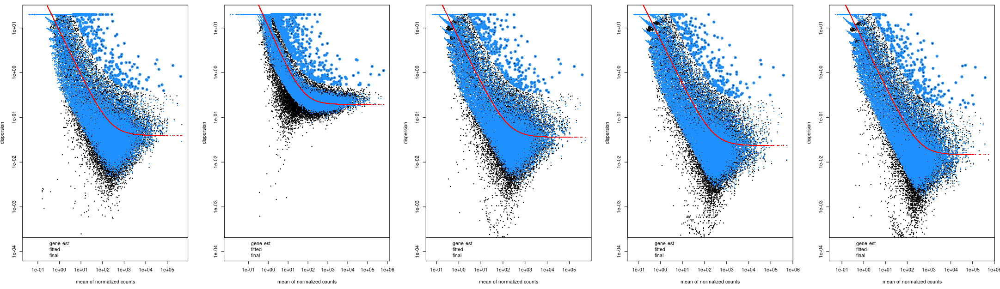

# RNA-Rx (RNA-seq with Reference eXogenous) pipeline

*Method and algorithms by Geoffrey Schivre, adapted to R and documented by Adrien Vidal.*

*Published in:
_Genome-scale transcriptome augmentation during Arabidopsis thaliana photomorphogenesis
Geoffrey Schivre, Léa Wolff, Filippo Maria Mirasole, Elodie Armanet, Mhairi L. H. Davidson, Adrien Vidal, Delphine Cuménal, Marie Dumont, Mickael Bourge, Célia Baroux, Clara Bourbousse, Fredy Barneche
 bioRxiv 2025.01.30.635720; doi: https://doi.org/10.1101/2025.01.30.635720_*

 The instructions on this page rely on the following key terms:
* **Sample:** One biological replicate of one genotype in one condition.
* **Biological replicate:** Samples corresponding to the same genotype and condition.
* **Replicate group:** The set of all samples that are biological replicates of each other.
* **Principal:** Any item specifically related to the studied organism (genome, genes, peaks, etc.) will be qualified as "principal".
* **Spike-in:** Any item related to the exogenous organism (genome, genes, peaks, etc.) will be qualified as "spike-in".

Some sections in this pipeline differ depending on the mapping and quantifier tools used, i.e. STAR + htseq-count (on genes) or Salmon (on transcripts).
From the [trimmed reads](#trimming), two branching paths are available:
* [Alignment to the genome](#alignment) using `STAR` and `sambamba` leading to the creation of genomic [tracks](#tracks), [PCA, and correlation plots](#summary) using `deeptools` and to [read counts on features](#htseq) using `htseq-count`.
* [Alignment to the transcripts](#salmon) using `salmon` to obtain estimated counts on genes with `tximport`.
Both paths produce read counts on which to perform a [differential analysis](#diff) using `DESeq2`, `ashr`, and `cate`.

The studied organism is later noted as the principal organism and the exogenous organism used for normalization as the spike-in organism.

Required files:

* `FASTQ` files of read sequencing data for each sample.
  * May be compressed as a `.gz` archive.
  * In the case of paired-end sequencing, two files per sample with matching read IDs are needed.
* `FASTA` files of potential contaminants to control for (optional).
* `FASTA` file of the sequences of the sequencing adapters (optional).
* `FASTA` file of the principal organism's reference genome.
* `FASTA` file of the spike-in organism's genome.
* A BED file of the genes to analyze (from principal and spike-in organisms). The 4th column must contain gene identifiers (IDs). The file can be produced from a GFF annotation using the [bedFromGff.pl](https://github.com/vidal-adrien/ChIP-Rx-Pipeline-Pub/blob/main/bedFromGff.md) script.

When using Salmon for mapping and counting:
* `FASTA` file of the principal organism's transcripts.
* `FASTA` file of the spike-in organism's transcripts.
* `BED` file of the mRNA encoding genes for the principal organism (genes_principal.bed).
* `BED` file of the mRNA encoding genes for the spike-in organism (genes_spikein.bed).
    * The $4^{th}$ column of those `BED` files must contain the gene IDs.
    * A `BED` file can be produced from a `GFF` annotation using the [bedFromGff.pl](bedFromGff.md) script.
* A transcript-to-gene correspondence table for the principal organism (tx2gene_principal.tsv)
* A transcript-to-gene correspondence table for the spike-in organism (tx2gene_spikein.tsv)
    * These tables are two-column tabulated files reporting the gene ID for each transcript ID (example below).
    * This information can be extracted from a `GFF` file using the [tx2GeneFromGff.pl](tx2GeneFromGff.md) script.

When using STAR for mapping and ht-seq count for counting:
* A `GFF` file of the genes to analyze (from principal and spike-in organisms).

See the [file formats quick reference](https://github.com/vidal-adrien/ChIP-Rx-Pipeline-Pub/blob/main/fileFormats.md) for more information about the types of files used and produced throughout this pipeline.

Unless specified otherwise, all code examples are in the bash Unix Shell command language.

The following programs are used in this pipeline:

* [fastqc](https://www.bioinformatics.babraham.ac.uk/projects/fastqc/) (optional)
* [fastq_screen](https://www.bioinformatics.babraham.ac.uk/projects/fastq_screen/) (optional)
* [Trimmomatic](http://www.usadellab.org/cms/?page=trimmomatic)
* [salmon](https://salmon.readthedocs.io/en/latest/salmon.html), when using Salmon for mapping and transcript quantification
* The [sambamba](http://lomereiter.github.io/sambamba/) toolkit
* [htseq_count](https://htseq.readthedocs.io/en/master/htseqcount.html), only when using STAR for mapping
* [cate](https://cran.r-project.org/src/contrib/Archive/cate/cate_1.1.tar.gz)\*
* The [R](https://www.r-project.org/) language with the following packages:
  * [DESeq2](https://bioconductor.org/packages/release/bioc/html/DESeq2.html)
  * [ashr](https://cran.r-project.org/web//packages/ashr/index.html)
  * [gplots](https://cran.r-project.org/web/packages/gplots/)
  * [ggplot2](https://ggplot2.tidyverse.org/)
  * [RColorBrewer](https://cran.r-project.org/web/packages/RColorBrewer/index.html)
  * [tximport](https://bioconductor.org/packages/release/bioc/html/tximport.html), when using Salmon for mapping and transcript quantification

**\*** *The `cate` library is no longer available on CRAN. It must be installed manually from its [archive](https://cran.r-project.org/src/contrib/Archive/cate/cate_1.1.tar.gz). Its `esaBCV` dependency must also be installed from its [archive](https://cran.r-project.org/src/contrib/Archive/esaBcv/esaBcv_1.2.1.tar.gz). `cate` has a further two dependencies in `ruv` and `leapp` and `esaBCV` has a further dependency in `svd` which can be all installed from CRAN through `install.packages`.*
```R
    install.packages(c("ruv", "leapp", "svd"))
    install.packages("esaBcv_1.2.1.tar.gz", repos=NULL, type="source")
    install.packages("cate_1.1.tar.gz", repos=NULL, type="source")
```

## 1) <a id="indexing">Reference genome indexing</a>

This section presents the indexing of the reference genomes (principal and spike-in) for different alignment tools used throughout the pipeline. These steps are only needed the first time running `STAR`, `salmon`, or `bowtie2` on the combined genomes and/or transcripts from the principal and spike-in organisms, as the index files created by these tools can be reused for any subsequent analyses.

### 1.1) <a id="starindexing">STAR index (when using STAR for mapping and to produce visualization tracks)</a>

#### **Combining the principal and spike-in organism genome sequences**
A unique `FASTA` file, with the spike-in chromosomes designated by a common label, allowing them to be easily extracted later, can be created with the following command:

```shell
cp principal_genome.fasta principal+spikein_genome.fasta
cat spikein_genome.fasta | sed "s/>/>$SPIKE_IN_TAG/" >> principal+spikein_genome.fasta
```

#### **Indexing**
The combined genome is then indexed by [STAR](https://github.com/alexdobin/STAR) with the `--runMode genomeGenerate` option.
The STAR manual advises using the following formula to calculate the value for the `--genomeSAindexNbases` argument of its indexing mode:

$$\LARGE{\min(14,~\frac{1}{2}*log_{2}(\sum_{i=1}^{C}L_i)-1)}$$

Where $C$ is the number of chromosomes on the genome assembly to index and $L_i$ is the length in base pairs of a chromosome $i$.

To compute this formula, first use the [bedFromFasta.pl](bedFromFasta.md) script to produce a BED file describing the entire combined genome:
```shell
bedFromFasta.pl -i principal+spikein_genome.fasta -o principal+spikein_genome.bed
```

Build the index for the STAR aligner using `--runMode genomeGenerate`. The directory given as the `--genomeDir` must be empty.
```shell
NBASES=$(Rscript -e "writeLines(as.character(as.integer(
    min(14, log2(sum(
        read.table('principal+spikein_genome.bed')[[3L]]
    ))/2 - 1)
)))")
```

Then the index is built for the STAR aligner using `--runMode genomeGenerate`. The directory given as the `--genomeDir` must be empty.

```shell
STAR --runMode genomeGenerate \
    --runThreadN $THREADS \
    --genomeSAindexNbases NBASES \
    --genomeFastaFiles principal+spikein_genome.fasta \
    --genomeDir STAR_index/
```

### 1.2) <a id="salmonindexing">salmon index (when using SALMON for mapping and counting) </a>

This step is necessary for `salmon` [quantification](#salmon). It is only needed the first time as the index files created by this tool can be used for any subsequent analyses with the same combination of principal and spike-in transcripts.

#### **Combining the principal and spike-in organism transcript and genome sequences**
Combine the transcripts `FASTA` files of both the principal and spike-in organisms and index them with `salmon index`.
To improve `salmon`'s mapping, genome assembly sequences of both organisms can be provided as a decoy by merging the assembly `FASTA` files with the transcripts `FASTA` files and recording the identifiers of the genomic sequences in a separate file.
When merging genome assemblies, adding an extra tag to the spike-in sequence IDs may be necessary if the chromosomes are labeled similarly.

```shell
# concatenate transcript sequences of both organisms
cat transcripts_principal.fasta transcripts_spikein.fasta > transcripts_principal+spikein.fasta

# concatenate genome sequences of both organisms and add a tag to the spike-in chromosome names
cat genome_principal.fasta <(cat genome_spikein.fasta | sed "s/>/>$SPIKE_IN_TAG/") > genome_principal+spikein.fasta

# create a text file with the chromosome names of both organisms that will reference the decoy
grep '>' genome_principal+spikein.fasta | sed "s/>//" > salmon_decoy.txt
# concatenate the sequences of genomes and transcripts of both organisms
cat transcripts_principal+spikein.fasta genome_principal+spikein.fasta > transcripts+genome_principal+spikein.fasta

```

#### **Indexing**
A k-mers length (`-k`) of 31 is recommended for reads longer than 75bp.

```shell
salmon index -k 31 \
    -t transcripts+genome_principal+spikein.fasta \
    -i salmon_index/ \
    -d salmon_decoy.txt \
    -p $THREADS \
    --tmpdir tempDir/
```

### 1.3) <a id="bt2indexing">bowtie2 indexes (Required for fastq-screen quality check)</a>

This step is necessary for [contamination screening](#fastqscreen) with [fastq_screen](https://www.bioinformatics.babraham.ac.uk/projects/fastq_screen/).

The reference genomes are indexed using the [bowtie2-build](https://bowtie-bio.sourceforge.net/bowtie2/manual.shtml#the-bowtie2-build-indexer) command. This bowtie2 indexing procedure is also applied to the fasta sequences of each contaminant to screen against (*e.g* human, yeast, PhIX, etc.).

```shell
bowtie2-build -threads $THREADS principal_genome.fasta principal_genome

bowtie2-build -threads $THREADS spikein_genome.fasta spikein_genome

bowtie2-build -threads $THREADS human_genome.fasta human_genome

bowtie2-build -threads $THREADS yeast_genome.fasta yeast_genome

...
```

The last argument (in this case `"principal_genome"`) is the prefix that was used to name each file in the index. This will by default equal the name of the `FASTA` file without the extension if unspecified. Specifying it is useful to differentiate different index builds or to specify the path of the directory to contain the index files.

This procedure will produce 6 files respectively to the prefix:

```
principal_genome.1.bt2
principal_genome.2.bt2
principal_genome.3.bt2
principal_genome.4.bt2
principal_genome.rev.1.bt2
principal_genome.rev.2.bt
```

## 2) Quality control

This section presents two optional steps to perform quality checks on each `FASTQ` read sequence file: quality of reads and presence of contaminants.

### 2.1) <a id="fastqc">Quality report</a>

The [fastqc](https://www.bioinformatics.babraham.ac.uk/projects/fastqc/) tool produces quality reports on the read files (percentage of duplicate reads, sequence content biases and quality, etc.). It will output several files in a target directory.

**Example fastqc command:**
```shell
fastqc \
    -t $THREADS \
    -d tempDir/ \
    -o outputDir/ \
    reads.fastq
```
To be run for each `FASTQ` read file in the analysis.

### 2.2) <a id="fastqscreen">Contamination screening</a>

The [fastq_screen](https://www.bioinformatics.babraham.ac.uk/projects/fastq_screen/) tool is used, with [bowtie2](https://bowtie-bio.sourceforge.net/bowtie2/index.shtml), to quantify the presence of contaminant sequences in each `.fastq` read file in the analysis. A custom configuration file such as [this example](fastq_screen.conf) can be used instead of the default configuration file for detection if specific contaminants are expected (default include human, mouse, rat, worm, Drosophila, Arabidopsis, Yeast, E. coli, rRNA, mitochondria, PhiX, Lambda, Vector, and Adapters).

Each of the `DATABASE` entries in the configuration file indicates the path to the folder containing the index files produced by the same aligner tool as the `--aligner` argument indicates (in our case, we will use bowtie2). This is done as explained in the [reference genome indexing section](#bt2indexing). There must be a `DATABASE` entry for the principal genome and another for the spike-in genome. Apply the command below to each `FASTQ` read file.

**Example fastq_screen command:**
```shell
fastq_screen \
    --force \
    --subset 100000 \
    --threads $THREADS \
    --outdir outputDir/ \
    --aligner bowtie2 \
    --conf fastq_screen.conf \
    sample.fastq
```

## 3) <a id=trimming>Read trimming</a>

**Note: `fastq.bz2` files:** another popular compression format for `FASTQ` and other files is `.bz2`. While many tools supposedly support it natively as they do with `.gz`, some of the tools (*e.g* `fastq_screen`, `trimmomatic`) used in this pipeline presented issues when trying to use this format as input. Files can be converted from `.bz2` format to `.gz` like so:
```shell
bzcat file.fastq.bz2 | gzip - > file.fastq.gz
```

**Note: multiple files per sample:** Sometimes the reads of a sample may be split between several files. These files will need to be merged into a single file like so:
```shell
cat sample_file1.fastq sample_file2.fastq > sample.fastq
```
This command can be used with files compressed in a `.gz` or `.bz2` format (all in the same format) since pasting multiple of these archives as if they were plain text will result in a valid archive of that format. This may not work with other archive formats.

The [Trimmomatic](http://www.usadellab.org/cms/?page=trimmomatic) tool is applied to each `FASTQ` file to trim the reads. The command line is different between single-end and paired-end applications. The adapter sequences must be provided as a `FASTA` file.

The 3 numbers added after the adapter file path are the seed mismatches, palindrome clip threshold and simple clip threshold respectively. See the [trimmomatic documentation](http://www.usadellab.org/cms/?page=trimmomatic) for details about these values.

The `LEADING` and `TRAILING` values are phred score threshold for trimming bases. `MINLEN` is the minimum length of reads after trimming under which the reads are discarded from the dataset.

**Example single-end trimmomatic command:**
```shell
trimmomatic SE \
    -threads $THREADS \
    -phred33 \
    sample.fastq \
    sample.trimmed.fastq \
    ILLUMINACLIP:adapters.fasta:2:30:10 \
    LEADING:5 TRAILING:5 MINLEN:20
```

**Example paired-end trimmomatic command:**
```shell
trimmomatic PE \
    -threads $THREADS \
    -phred33 \
    -validatePairs \
    sample_1.fastq \
    sample_2.fastq \
    sample_1.trimmed.fastq \
    sample_1.trimmed.unpaired.fastq \
    sample_2.trimmed.fastq \
    sample_2.trimmed.unpaired.fastq \
    ILLUMINACLIP:adapters.fasta:2:30:10 \
    LEADING:5 TRAILING:5 MINLEN:20
```

The files marked unpaired are unnecessary and may be deleted immediately:

```shell
rm -f sample_*.trimmed.unpaired.fastq
```

The fastq files produced by trimmomatic are compressed to save space:

```shell
pigz -p $THREADS -v sample.trimmed.fastq
```

To control the quality of the data after trimming, the [fastqc command](#fastqc) is repeated on the trimmed `FASTQ` files.

## 4) <a id=alignment>Mapping with STAR</a>

This section presents a series of commands to produce a `BAM` alignment file for each sample.
Those `BAM` alignment files are used to produce [visualization tracks](#tracks) and to [count reads overlapping with genes with `htseq-count`](#htseq). In case quantifications of transcript levels are made with the `salmon` tool and no visualization tracks are needed, this section can be skipped.

* One `FASTQ` file is needed for single-end mapping while two files (one for the first mate and one for the second mate sequencing) are required for paired-end mapping.
* The input files may used in a compressed `.gz` archive.

### 4.1) Mapping with STAR

[STAR](https://github.com/alexdobin/STAR) aligns reads to the reference genome, allowing gaps corresponding to introns.
The output bam alignment files are used to produce visualization tracks (Section 7) and to count reads overlapping with genes with ht-seq count (Section 5).

Arguments:
* `--alignIntronMin` and `--alignIntronMax`: range of lengths allowed for these intron gaps.
* `--readFilesIn`: indicates the input read file. If two files are given the aligner will operate in paired-end mode.
* `--readFilesCommand`: adapted to the type of compression of the input, if any (*e.g.* `cat` for an uncompressed `FASTA` file or `zcat` for a compressed `.fasta.bz` file).
* `--genomeDir`: folder in which the [index](#indexing) was produced.
* `--outSAMtype`: determines the output type, in this case a sorted `BAM` file.
* `--outFileNamePrefix`: string that prefixes the output file names (*e.g.* the alignment file name will be `<prefix>_Aligned.sortedByCoord.out.bam` for a sorted `BAM` output).
* `--outFilterMismatchNmax`: number of allowed mismatches in each alignment.
* `--outSAMmultNmax`: maximum number of alignments allowed for each read.
* `--outMultimapperOrder` how alignments with equal quality are picked out.
* `--outFilterMultimapNmax` maximum number of alignments allowed for a multimapping read before being filtered out entirely. The default value is 10.
More information can be found in the [STAR manual](https://raw.githubusercontent.com/alexdobin/STAR/master/doc/STARmanual.pdf).

The alignment is indexed with [sambamba index](https://lomereiter.github.io/sambamba/docs/sambamba-index.html).

**Example single-end STAR alignment command:**

```shell
STAR --alignIntronMin 4 --alignIntronMax 16000 --runThreadN $THREADS \
    --readFilesIn sample.trimmed.fastq.gz --readFilesCommand zcat \
    --genomeDir STAR_index/ \
    --outTmpDir $TMP \
    --outSAMtype BAM SortedByCoordinate --outFileNamePrefix sample \
    --outFilterMismatchNmax 2 --outSAMmultNmax 1 --outMultimapperOrder Random

sambamba index -t $THREADS sample_Aligned.sortedByCoord.out.bam
```

**Example paired-end STAR alignment command:**

```shell
STAR --alignIntronMin 4 --alignIntronMax 16000 --runThreadN $THREADS \
    --readFilesIn sample_1.trimmed.fastq.gz sample_2.trimmed.fastq.gz --readFilesCommand zcat \
    --genomeDir STAR_index/ \
    --outTmpDir $TMP \
    --outSAMtype BAM SortedByCoordinate --outFileNamePrefix sample \
    --outFilterMismatchNmax 2 --outSAMmultNmax 1 --outMultimapperOrder Random

sambamba index -t $THREADS sample_Aligned.sortedByCoord.out.bam
```

### 4.2) <a id="filtering">Read filtering</a>

Filters are applied using [sambamba view](https://lomereiter.github.io/sambamba/docs/sambamba-view.html). The flag used to filter encompasses the following:

|2572||
|:----|:--------------------------------------------|
| = 4 | read unmapped |
| + 8 | pair unmapped (does nothing in single-end) |
| + 512 | read fails platform/vendor quality checks |
| + 2048 | supplementary alignment  |

**Example filtering command:**

```shell
sambamba view \
    -h -f bam \
    -t $THREADS \
    --num-filter /2572 \
    -o sample.filtered.bam \
    sample_Aligned.sortedByCoord.out.bam

sambamba index -t $THREADS sample.filtered.bam
```

### 4.3) <a id="splitting">Splitting reads between principal and spike-in reads</a>

The reads aligned to the principal and spike-in genomes are separated using the `-L` option for [sambamba view](https://lomereiter.github.io/sambamba/docs/sambamba-view.html) according to the presence of the spike-in the tag (Section 1).

**Example split script:**

```shell
sambamba view -h -t $THREADS sample.filtered.bam \
    | grep -v ${spikeInTag} \
    | sambamba view -S -t $THREADS -f bam \
    -o sample.principal.filtered.nodup.bam /dev/stdin

sambamba index -t $THREADS sample.principal.filtered.nodup.bam

sambamba view -h -t $THREADS ${input_bam} \
    | grep ${spikeInTag} \
    | sed s/${spikeInTag}// \
    | sambamba view -S -t $THREADS -f bam \
    -o sample.spikein.filtered.nodup.bam /dev/stdin

sambamba index -t $THREADS sample.spikein.filtered.nodup.bam
```

### 4.4) File clean up

The pipeline creates large intermediate files that can be deleted. The only bam files that are necessary for downstream analysis are the files produced by [the filtering step](#filtering). All previous `.bam` files and their associated `.bai` index files, and the trimmed `.fastq` files may be deleted or archived.


### 4.5) <a id="strandedness">Strandedness of the samples</a>

Based on how the libraries are prepared, RNA-seq samples may be strand-specific or not.
If it is strand-specific, reads may be in the sense or antisense direction depending on sequencing platforms.
If this information is not known *a priori*, it may be tested using the [Integrative Genomic Browser](https://igv.org/). This information will be used to produce strand-specific tracks if wanted (Section 7.3), and to assign reads to genes using htseq-count (Section 5).


* Load a `BAM` file and the genes annotation in IGV
 * If the reads align in both directions on the genes, the sample is not stranded.
 * If the reads align in the same direction as the gene, it is strand-specific in the *sense* direction.
 * If the reads align in the opposite direction as the gene, it is strand-specific in the *antisense* direction.

## 5) <a id=coverage>Quantify read counts over genes</a>

We propose two methods to quantify gene expression:
* `htseq_count` simply counts the reads that overlap with genomic regions (genes, TEs, etc.) from the alignment `BAM` files produced by the [`STAR` aligner](#alignment). This is suitable for most analyses.
* `salmon` pseudo-aligner quantifies transcripts and is useful to quantify transcript isoform relative abundance or to perform specific statistical approaches (*e.g.* the [identification of stable genes](rnaRxStableGenes.md).

### 5.1) <a id="htseq">With htseq-count (after STAR alignment)</a>

`htseq_count` processes all samples in parallel. Some extra file manipulations are proposed to obtain a `BED` output with all genes in a given order.

The coverage is measured on the set of `BAM` files produced in 4.3 using a combined gene annotation of the principal and spike-in genomes in `GFF` format.

**Input files:**
```shell
BAMS=(sample1.bam sample2.bam ... sampleN.bam) # List the of BAM files (space separated)

input_gff=regions.gff # GFF annotation file
```

**Preparation of the gff file:**
`htseq_count` processes a single feature type from the `GFF` file, which is "exon" by default. The feature type can be changed with the `-t` argument but if one wants to process multiple feature types (for example, below, genes and transposable elements), all desired features must be replaced by the same string. For this, the following code:
* Filters the desired features from the `GFF` annotation file.
* Sorts the result by genomic position.
* Unifies the desired feature as an artificial "LOCUS" feature.
* Trims all attributes other than the feature ID to minimize the chances of `htseq_count` encountering a syntax issue with special characters.

```shell
output_bed=regions_coverage.bed

features=(gene transposable_element) # List the feature types (space separated)

# Base for the names of the temporary/output files:
base=$(basename ${input_gff%.*})

# Awk command to filter the gff file by feature:
awk_command="awk '{ if ("
for feature in "${features[@]}"; do
    awk_command+="\$3 == \"${feature}\" || "
done

awk_command=${awk_command%|| }") { print } }'"

file_f_gff=${TMP}/${base}_filtered.${input_gff##*.}
eval "${awk_command}" < ${input_gff} > ${file_f_gff}

# Sort the filtered file using bedtools:
file_fs_gff=${TMP}/${base}_filtered_sorted.${input_gff##*.}
bedtools sort -i ${TMP}/${base}_filtered.${input_gff##*.} > ${file_fs_gff}

# Unify selected features as "LOCUS" for htseq_count and remove everything from the attributes other than the main attribute to remove potential parsing issues.
file_fsu_gff=${TMP}/${base}_filtered_sorted_unified.${input_gff##*.}
paste <(cut -f1,2 ${file_fs_gff}) \
      <(cut -f3 ${file_fs_gff} | sed 's/.*/LOCUS/') \
      <(cut -f4-8 ${file_fs_gff}) \
      <(cut -f9 ${file_fs_gff} | grep -oP "${id_attribute}=.*?;") \
      > ${file_fsu_gff}
```

**Launch htseq-count**
The `-s` argument must be specified as `'yes'` for forward strandedness, `'reverse'` for reverse strandedness or `'no'` (default) if not stranded (see [section 4.5](#strandedness) for details).
```shell
# Run htseq_count:                                                 Extra arguments here ┐
file_coverage_tsv=${TMP}/${base}_counts.tsv #                                           v
htseq-count -n ${threads} -i ${id_attribute} -r pos -t LOCUS -c ${file_coverage_tsv} -s   ${bams[@]} ${file_fsu_gff}
```

The output is a tabulation-separated table. The features (i.e., genes) are also sorted alphanumerically rather than in the same order as the input. To obtain a `BED` file of the counts sorted in the same order as the `GFF` annotation file:
* The [bedFromGff.pl](bedFromGff.md) script creates a `BED` file of the regions described in the `GFF` annotation.
* The output of `htseq_count` is then sorted and added to the previous `BED` with an R code.

**Shell**
```shell
# Create a bed file out of the gff file:
file_annot_bed=${file_fsu_gff%.*}.bed
$(dirname $0)/../perl/bedFromGff.pl -i ${file_fsu_gff} -o ${file_annot_bed} -ida ${id_attribute}

file_coverage_s_tsv=${TMP}/${base}_counts_sorted.tsv
file_summary=$(dirname ${output_bed})/${base}_summary.tsv
```

**R**
```R
ids <- read.table("${file_annot_bed}")[[4L]]
coverage <- read.table("${file_coverage_tsv}")
write.table(
    coverage[ startsWith(coverage[[1L]], '__'), ],
    "${file_summary}",
    row.names=FALSE, col.names=FALSE, quote=FALSE, sep="\t"
)
write.table(
    coverage[ match(ids, coverage[[1L]]), ],
    "${file_coverage_s_tsv}",
    row.names=FALSE, col.names=FALSE, quote=FALSE, sep="\t"
)
```

The counts from the sorted coverage file, the `BED` file of the annotation and the original feature type column from the `GFF` file are pasted to form the coverage file in a `BED` format.
```shell
paste ${file_annot_bed} <(cut -f2- ${file_coverage_s_tsv}) <(cut -f3 ${file_fs_gff}) > ${output_bed}
```

An extra column indicating the organism of origin of each feature is added:

```shell
cat <(yes "principal" | head -n <(wc -l regions_coverage_principal.bed)) <(yes "spikein" | head -n <(wc -l regions_coverage_spikein.bed)) > organism.txt

paste <(cat regions_coverage_principal.bed regions_coverage_spikein.bed) <(cat organism.txt) > regions_coverage_principal+spikein.bed

rm organism.txt
```

### 5.2) <a id="salmon">With salmon (on the trimmed Fastq files)</a>


The [salmon](https://salmon.readthedocs.io/en/latest/salmon.html) `quant` command estimates the share of reads corresponding to each transcript starting from the trimmed `FASTQ` files (Section 3). Options are available for sequence (`--seqBias`) and GC (`--gcBias`) bias correction.
* `-i` points to the [index](#salmonindexing)
* `-l` indicates the library type as explained [here](https://salmon.readthedocs.io/en/latest/salmon.html#what-s-this-libtype)
* `-r` is used for single-end alignment, while `-1` and `-2` are used to indicate the two `FASTQ` read file(s) of a paired-end sequencing
* `--numGibbsSamples`: number of replicates to use in the Gibbs sampling to estimate the variance in the abundance estimates (here 100)
* `--thinningFactor`: number of steps to discard for every sample kept from the Gibbs chain (using a factor of 100 for 100 Gibbs replicates means 10,000 will be generated)

**Example single-end salmon alignment command:**
```shell
salmon quant -l SF \
    -i salmon_index/ \
    -r sample.trimmed.fastq.gz \
    -o sample_quant/ \
    -p $THREADS
    --seqBias --gcBias \
    --numGibbsSamples 100 --thinningFactor 100 \
```

**Example paired-end salmon alignment command:**
```shell
salmon quant -l SF \
    -i salmon_index/ \
    -1 sample_1.trimmed.fastq.gz \
    -2 sample_2.trimmed.fastq.gz \
    -o sample_quant/ \
    -p $THREADS
    --seqBias --gcBias \
    --numGibbsSamples 100 --thinningFactor 100 \
```

The `quant.sf` file in the respective output folder for each sample is processed in `R` using the [tximport](https://bioconductor.org/packages/release/bioc/html/tximport.html) library.
The quantification on transcripts is transformed into a quantification on genes using a two-column tabulated file to match each transcript ID present in the transcripts `FASTQ` file to a gene ID. This transcript-to-gene correspondence table combines principal and spike-in transcripts.

**Example of transcript to gene table:**
```
AT1G01010.1  AT1G01010
AT1G01010.2  AT1G01010
AT1G01010.3  AT1G01010
AT1G01020.11 AT1G01020
AT1G01020.13 AT1G01020
AT1G01020.14 AT1G01020
AT1G01020.15 AT1G01020
AT1G01020.16 AT1G01020
...
FBtr0114258	FBgn0085804
FBtr0302440	FBgn0039987
FBtr0347367	FBgn0267798
FBtr0347366	FBgn0267797
FBtr0302347	FBgn0058182
FBtr0445191	FBgn0267430
FBtr0345282	FBgn0266747
FBtr0345281	FBgn0266747
...
```

The `scaledTPM` method for count estimate as advised in the `tximport` [vignette](https://bioconductor.org/packages/release/bioc/vignettes/tximport/inst/doc/tximport.html#Downstream_DGE_in_Bioconductor) to correct the genes length according to transcript isoform usage and summarize inferential replicates (produced by Gibbs sampling [vignette]([https://salmon.readthedocs.io/en/latest/salmon.html])) using the median instead of the mean. The posterior median tends to be a better point estimate when the posterior is highly skewed, which is the case for the positively restricted transcript abundance estimates.

**Note:** The transcript-to-gene table (table.tx2gene) and the gene table (table.genes) must contain the same set of gene IDs. Some filtering may be required to ensure this.

**Example of processing with tximport (R):**
```R
library(tximport)

dirs.quant <- c("sample1_quant", "sample2_quant", ..., "sampleN_quant")

table.tx2gene.principal <-  structure(read.table("tx2gene_principal.tsv"), names = c("transcript", "gene"))
table.tx2gene.spikein <- structure(read.table("tx2gene_spikein.tsv"), names = c("transcript", "gene"))
table.tx2gene <- rbind(table.tx2gene.principal, table.tx2gene.spikein)

genes.quant <- tximport::tximport(
    files = paste0(dirs.quant, "/quant.sf"),
    type = "salmon",
    tx2gene = table.tx2gene,
    countsFromAbundance = "scaledTPM",
    varReduce = TRUE,
    infRepStat = matrixStats::rowMedians
)$counts
```


The counts and the genes' information from the `BED` table are combined to obtain a coverage `BED` file.

```R
    names(genes.quant) <- c("sample1", "sample2", ..., "sampleN")

    table.genes.principal <- structure(
        read.table("genes_principal.bed"),
        names=c("chrom", "chromStart", "chromEnd", "name", "score")
    )
    table.genes.spikein <- structure(
        read.table("genes_spikein.bed"),
        names=c("chrom", "chromStart", "chromEnd", "name", "score")
    )
    table.genes <- rbind(table.genes.principal, table.genes.spikein)

    organism <- c(
        rep("principal", nrow(table.genes.principal)),
        rep("spikein", nrow(table.genes.spikein))
    )

    ord <- match(rownames(genes.quant),  table.genes$name)
    genes.quant.table <- data.frame(
        table.genes[ord, ],
        genes.quant,
        type="gene",
        organism=organism[ord]
    )

    write.table(genes.quant.table, "genes_coverage_principal+spikein.bed", row.names=FALSE, col.names=FALSE, quote=FALSE, sep="\t")
```

## 6) <a id="diff">Differential analysis</a>

The differential analysis of the coverage over genes and transposable elements is made using the [DESeq2](https://bioconductor.org/packages/release/bioc/html/DESeq2.html) package for the [R language](https://www.r-project.org/). It uses the gene count table obtained from htseq_count (see [Section 5.1](#htseq)) or Salmon (see [Section 5.2](#salmon)).
The following packages need to be loaded:
- [gplots](https://cran.r-project.org/web/packages/gplots/)
- [RColorBrewer](https://cran.r-project.org/web/packages/RColorBrewer/index.html)
- [ggplot2](https://ggplot2.tidyverse.org/).

From this point on, all code examples are in the [R language](https://www.r-project.org/).

The use of a spike-in can increase the variability of gene expression estimates.
This can be tested by plotting and comparing data dispersion after DESeq2 using sizeFactors calculated from the coverage over principal genes (classical RNA-seq procedure) with data dispersion using sizeFactors calculated from the spike-in genes (RNA-Rx), as described in Section 6.1.
If dispersion is higher for RNA-Rx DESeq2 than classical RNA-seq DESeq2, a factor-augmented model with latent variables is proposed to absorb the variability induced by non-observed confounders (Section 6.2) (see [Leek et al. 2012](https://www.ncbi.nlm.nih.gov/pmc/articles/PMC3307112/), [Risso et al. 2014](https://www.nature.com/articles/nbt.2931), [Wang et al. 2017](https://www.ncbi.nlm.nih.gov/pmc/articles/PMC6706069/)). To this end, the `cate` package estimates the latent factor and corrects the counts, which are then input to `DESeq2` for differential analysis.

### 6.1) <a id="sfest">Estimation of size factors</a>

`DESeq2` is used to estimate a first size factor calculated from the spike-in gene counts.

The table describing the experimental design contains a unique name for each sample and as many variables as necessary to describe the samples (genotype, condition, replicate, etc.). Consider only adding a variable if there is a reason that it should contribute to the variability. For example, a `replicate` variable if there is a potential batch effect between replicate groups (samples within a group corresponding to the same plant seed lot, to an experiment done at the same time, etc.). Below is a design example to adapt to the user's experimental design.
The experimental design table should have one row for each sample <ins>in the same order</ins> as the columns in the previously built [coverage table](#coverage).

**Example experimental design table (R console output):**
```
sampleName  genotype    condition   replicate
WT_L_rep1   WT          Light       Rep1
WT_L_rep2   WT          Light       Rep2
mut_L_rep1  mut         Light       Rep1
mut_L_rep2  mut         Light       Rep2
WT_D_rep1   WT          Dark        Rep1
WT_D_rep2   WT          Dark        Rep2
mut_D_rep1  mut         Dark        Rep1
mut_D_rep2  mut         Dark        Rep2
...
```


Loading of the coverage table:
```R
table.coverage <- structure(
    read.table("gene_coverage.bed"),
    names = c(
        "chrom", "chromStart", "chromEnd", "name", "score", "strand", # bed file columns.
        table.design$sampleName, # counts columns.
        "type", "organism"
    )
)
```

A first estimation of the size factors is made using DESeq2 on the spike-in gene counts:
```R
size.factors <- BiocGenerics::sizeFactors(BiocGenerics::estimateSizeFactors(
    suppressWarnings(DESeq2::DESeqDataSetFromMatrix(
        countData = table.coverage[table.coverage$organism == "spikein", table.design$sampleName],
        colData = table.design,
        design = ~ genotype + condition + replicate
    ))
))
```

The size factors are centered on their geometric mean.
```R
size.factors <- size.factors / exp(mean(log(size.factors)))
```

### 6.2) <a id="cate">Spike-in variability mitigation with CATE</a>

#### **Log transformation of the counts and normalization**
Genes with a count of zero reads in all samples are discarded. The count table is transformed with a log2 function to use `cate` and to avoid taking the log of 0, an offset of 0.5 is added to every count. The estimated size factors are applied to normalize the counts on the reference genes.

```R
genes.nonzero <- table.coverage$name[ rowSums(coverage[table.design$sampleId]) > 0]

counts.log <- sweep(
    log2( table.coverage[table.coverage$name %in% genes.nonzero, table.design$sampleId] + .5 ),
    MARGIN=2, log2(size.factors), `-`
)
```

#### **Selection of control genes**
The spike-in genes with at least 5 reads in each sample are selected. These genes will serve as normalization controls for which the biological variability is known to be null.

```R
genes.spikein.ref <- coverage$name[
    coverage$organism == "spikein" &
    apply(coverage[table.design$sampleId], 1L, min, na.rm=TRUE) > 5
]
```

#### **Running `cate` on the log normalized counts**
The `nc.var.correction` and `calibrate` are set to `FALSE` because they are only relevant for the `cate` differential analysis. The `formula` argument should contain the same set of variables as in the `DESeq2`'s `design` argument. However, variables that are considered to be "nuisance variables" should be separated from the rest to the right of the `"|"` character. The default behavior of `cate` is to consider the intercept as a nuisance variable. RNAseq count data have no absolute scaling, therefore the intercept should be kept as a nuisance variable to which other nuisance variables should be added. In this example, the `replicate` variable is considered a batch effect and should thus be treated as a nuisance variable. This is done by adding it to the right side of the formula: `| 1 + replicate`.

The `r` argument specifies the number of latent factors to estimate. A too-low number will retain some of the spike-in variability while a too-high number will remove biologically relevant variability. An `r` value of 1 is the most conservative choice. See the [note](#catefindr) below for an approach to finding the most appropriate value for `r`.

`counts.log` must be transposed so that the rows correspond to samples for the input of `cate`. The `%in%` operator produces the indices of the control genes within the table of the logs of the non-zero counts.

```R
library(cate)

cate.res <- cate::cate(
    formula = ~ genotype + condition | 1 + replicate,
    X.data = table.design,
    Y = t(counts.log),
    r = 1,
    fa.method = "esa",
    adj.method = "nc",
    nc = which(genes.nonzero %in% genes.spikein.ref), #Indices of reference genes in the filtered log counts table.
    nc.var.correction = FALSE,
    calibrate = FALSE
)
```

#### **Creation of a corrected count table**
With $Z$, the matrix of estimated latent factors, $\Gamma$ the matrix of estimated factor loadings, and $\vec{s}$ the DESeq2 estimated size factors.

$$\LARGE{C'= \lceil 2^{ (log_{2}(C) - \Gamma \otimes Z)\vec{s} }-0.5\rfloor}$$

```R
table.coverage.cate  <- table.coverage # Copy previous table and overwrite with new counts.
table.coverage.cate[
    table.coverage.cate$name %in% genes.nonzero,
    table.design$sampleId
] <- round( sweep(2 ^ (counts.log - cate.res$Gamma %*% t(cate.res$Z)), MARGIN=2, size.factors, `*`) - 0.5, digits = 0 )

table.coverage.cate[table.design$sampleId][ table.coverage.cate[table.design$sampleId] < 0 ] <- 0
```
#### **Re-estimation of size factors**

Size factors are estimated as above but using the cate corrected counts:

```R
size.factors.cate <- BiocGenerics::sizeFactors(BiocGenerics::estimateSizeFactors(
    suppressWarnings(DESeq2::DESeqDataSetFromMatrix(
        countData = table.coverage.cate[table.coverage$organism == "spikein", table.design$sampleName],
        colData = table.design,
        design = ~ genotype + condition + replicate
    ))
))
```

These size factors are also centered on their geometric mean.
```R
size.factors.cate <- size.factors.cate / exp(mean(log(size.factors.cate)))
```

<a id="catefindr"></a>

**Note:** A way to find the most appropriate value for `r`:
* (1) Build a `DESeq2` model with size factors calculated on the raw gene counts of the principal organism only (`table.coverage`) and compute its [dispersion plot](#dispersion-plot).
* (2) Apply the first estimated size factors (`size.factors`) to that model using `BiocGenerics::sizeFactors(dds) <- size.factors`. Compute its [dispersion plot](#dispersion-plot). This dispersion should be higher than in (1).
* (3) Perform the `cate` correction with an `r` value of 1 until obtaining the `cate` corrected principal counts (`table.coverage.cate`) and the corresponding estimated size factors (`size.factors.cate`).
* (4) Build a `DESeq2` model (as [below](#model_building)) with the `cate` corrected principal counts (`table.coverage.cate`) and apply the corresponding estimated size factors (`size.factors.cate`). Compute its [dispersion plot](#dispersion-plot).
* (5) If dispersion resembles the dispersion in (1), `r=1` was the appropriate `r` value. If dispersion is still higher than in (1), repeat steps (3) and (4) with higher `r` values for `cate` until reaching a dispersion close to (1).

<table align="left" width="1000" cellspacing="0" cellpadding="0">
    <tr>
        <td></td>
    </tr>
    <tr>
        <td><a href="./images/cate_disp_series.png?raw=1">⇗Full size image</a></td>
    </tr>
    <tr>
        <td width="1000"> Example dispersion plots for an Arabidopsis + Drosophila spike-in. From left to right: raw counts model, spike-in model, cate corrected model with r=1, cate corrected model with r=2, cate corrected model with r=3. r=1 is the closest to the raw count dispersion.</td>
    </tr>
</table>

### 6.3) Building the model
<a id=model_building></a>

The final model is built using cate-corrected size factors (`size.factors.cate`) on the cate-corrected principal organism gene counts (`table.coverage.cate`).

```R
dds <- DESeq2::DESeqDataSetFromMatrix(
    countData = as.matrix(table.coverage.cate[table.coverage.cate$organism == "principal", table.design$sampleName])
    colData = table.design,
    design = ~ genotype + condition + replicate
)

BiocGenerics::sizeFactors(dds) <- size.factors.cate
```

Finally, the model can be fitted by `DESeq2`:

```R
dds <- DESeq2::DESeq(dds)
```

### 6.4) Normalized counts

We can output the normalized coverage values for a set of regions such as, in the following example, genes.

```R
write.table(
    x= data.frame(
        table.coverage.cate[table.coverage.cate$type == "gene", 1L:6L],
        as.data.frame(BiocGenerics::counts(dds, normalized = TRUE))[table.coverage.cate$type == "gene", ]
    ),
    file = "genes_coverage.DESeq-norm.bed",
    row.names = FALSE, sep = "\t", quote = FALSE
)
```

### 6.5) Sample clustering by heatmap and PCA

Clustering heatmap and PCA plots with the normalized coverage are computed for the DESeq2 model. A "regularized log" transformation is applied to the count data.

```R
rld <- DESeq2::rlog(dds)
```

We can restrict the set of genes if we want to perform the clustering and PCA on a subset of genes.
```R
rld <- DESeq2::rlog(dds[table.coverage.cate$type == "gene"])
```

Draw the clustered heatmap plot with a `gplots` function.
```R
png(file="clustering.png", width=800L, height=800L)
gplots::heatmap.2(
    as.matrix(dist(t(SummarizedExperiment::assay(rld)))),
    trace="none",
    col=grDevices::colorRampPalette(rev(RColorBrewer::brewer.pal(9, "Blues")))(255),
    main="Clustering of expression on regions", margins = c(10L, 10L)
)
dev.off()
```

Principal Component Analysis performed by `DESeq2` and plotted using `ggplot2`.
```R
PCA_data <- DESeq2::plotPCA(rld, ntop=nrow(rld), intgroup=c("group", "rep"), returnData=TRUE)

ggplot2::ggsave("PCA.png",
    ggplot2::ggplot(PCA_data, ggplot2::aes(PC1, PC2, color = group.1 , shape = rep)) +
        ggplot2::geom_point(size = 3) +
        ggplot2::xlab(paste0("PC1: ", round(100 * attr(PCA_data, "percentVar"))[1], "% variance")) +
        ggplot2::ylab(paste0("PC2: ", round(100 * attr(PCA_data, "percentVar"))[2], "% variance")) +
        ggplot2::ggtitle("Total expression on regions") + 
        ggplot2::theme(plot.title = ggplot2::element_text(hjust = 0.5)),
    width = 5, height = 5, dpi = 300
)
```

<table align="left" width="300" cellspacing="0" cellpadding="0">
    <tr>
        <td></td>
    </tr>
    <tr>
        <td><a href="./images/deseq2_disp_example.png?raw=1">⇗Full size image</a></td>
    </tr>
    <tr>
        <td width="450"> Example of DESeq2 dispersion plot.</td>
    </tr>
</table>


### 6.6) Differential analysis

To identify differentially expressed genes, a contrast between two factors of a single variable is made with a `c(variable, value1, value2)` vector to obtain the value1/value2 Log2-Fold-Change on each gene. For instance, a contrast between the "Dark" and "Light" conditions:

```R
DESeq2::results(dds, contrast=c("condition", "Dark", "Light"), lfcThreshold=0.5, pAdjustMethod="fdr")
```

For more complex contrasts, the `DESeq2.contraster` function (based on [this blog page](https://www.atakanekiz.com/technical/a-guide-to-designs-and-contrasts-in-DESeq2/)) proposed below composes the proper `contrast` arguments for any comparison groups.

<details>
  <summary><b>DESeq2.contraster</b> (click to show)</summary>

```R
DESeq2.contraster <- function(dds, group1, group2, weighted = FALSE){
    # Dependencies
    if( !("package:DESeq2" %in% search()) ){ try(suppressMessages(library(DESeq2))) }

    # Unit tests
    if( class(dds) != "DESeqDataSet"){
        stop("Invalid 'dds' argument. Must be a DESeqDataSet object.")
    }

    if( !all(c("colData", "design") %in% slotNames(dds)) ){
        stop("Invalid 'dds' argument. Should contain the fields 'colData' and 'design'.")
    }

    var.elements <- structure(
        c(lapply(group1, "[", -1L), lapply(group2, "[", -1L)),
        names=c(sapply(group1, "[[", 1L), sapply(group2, "[[", 1L))
    )

    if( !all( sapply(
        1L:length(var.elements),
        function(iVar){
            if( (var <- names(var.elements)[iVar]) %in% names(dds@colData) ){
                all( var.elements[[iVar]] %in% dds@colData[[var]] )
            } else { FALSE }
        }
    ) ) ){
        stop("Unknown variables or factors found in `group1` or `group2`." )
    }

    # Application
    mod.mat <- model.matrix(design(dds), colData(dds))

    group1.rows <- group2.rows <- list()

    for(i in 1L:length(group1)){
        group1.rows[[i]] <- colData(dds)[[ group1[[i]][1L] ]] %in% group1[[i]][ 2L:length(group1[[i]]) ]
    }

    for(i in 1:length(group2)){
        group2.rows[[i]] <- colData(dds)[[ group2[[i]][1L] ]] %in% group2[[i]][ 2L:length(group2[[i]]) ]
    }

    group1.rows <- Reduce(function(x, y) x & y, group1.rows)
    group2.rows <- Reduce(function(x, y) x & y, group2.rows)

    mod.mat1 <- mod.mat[group1.rows, , drop=FALSE]
    mod.mat2 <- mod.mat[group2.rows, , drop=FALSE]

    if(!weighted){
        mod.mat1 <- mod.mat1[!duplicated(mod.mat1), , drop=FALSE]
        mod.mat2 <- mod.mat2[!duplicated(mod.mat2), , drop=FALSE]
    }

    return(colMeans(mod.mat1) - colMeans(mod.mat2))
}
```

</details>
In the following example, we will contrast the "Dark" and "Light" conditions on the "WT" genotype. We then filter by the feature type to select only the genes. The following steps can be repeated with TEs instead.

We can set the log2-Fold-Change value against which we test each gene's differential expression with the `lfcThreshold` argument (by default 0). For instance, a value of 0.5 means that we will estimate the p-value of the test that a gene has a log2-fold-change of expression compared to the control condition that is above 0.5 or below -0.5. We also apply a false discovery rate adjustment to the p-value using `pAdjustMethod="fdr"`.

```R
sel <- table.coverage$type == "gene"

result <- DESeq2::results(
    dds,
    contrast = DESeq2.contraster(
        dds,
        group1 = list( c("genotype", "WT"), c("condition", "Light") ),
        group2 = list( c("genotype", "WT"), c("condition", "Dark") )
    ),
    lfcThreshold = 0.5,
    pAdjustMethod = "fdr"
)[sel, ]

p.order <- order(result$padj)
result <- result[p.order, ]
ids <- table.coverage$name[sel][p.order]

compId <- "WT_Light.WT_Dark"
```

Using `ashr`, we apply shrinkage to the log2-Fold-Change values to allow better comparison between multiple datasets. We use a normal distribution for the `mixcompdist` argument. We don't use a `pointmass` at 0. The `mode` is estimated since we do not know on which value the log2-Fold-Change are centered.

```R
library(ashr)

sel <- !is.na(res$log2FoldChange)

result$log2FoldChange[sel] <- ashr::ash(
    res$log2FoldChange[sel],
    res$lfcSE[sel],
    mixcompdist = "normal",
    pointmass = FALSE,
    mode = "estimate"
)$result$PosteriorMean
```

We produce the following output files:

* The results table on all genes.
```R
write.table(
    x = data.frame(cbind(id=ids, result))
    file = paste0("/FC_expression_on_genes_", compId, "_all.tsv"),
    quote = FALSE, sep="\t", col.names=NA
)
```

* The results table of only the results for differentially expressed genes according to the p-value of the test.
```R
pval.thr <- 0.01
write.table(
    x = data.frame(subset(cbind(id=ids, result), padj < pval.thr)),
    file = paste0("/FC_expression_on_genes_", compId, "_diff.tsv"),
    quote = FALSE, sep="\t", col.names=NA
)
```

### 6.7) MA-Plots

* A scatter plot of the log2-Fold-Change against the mean of normalized count called "MA-plot". Adding a horizontal line for the average log2-Fold-Change to the plot is useful to view the offset caused by applying scaling factors.

```R
pval.thr <- 0.01
png(paste0(dirMAPlots_auto_genes, "/MA_expression_on_genes_", compId, ".png"), width = 800L, height = 800L)
DESeq2::plotMA(result, alpha = pval.thr, main = paste0("Genes: WT Light / WT Dark"), ylim = c(-4, 4))
lfc.average <- mean(res$log2FoldChange)
abline(h=lfc.average, lwd=2L, lty = "dashed",  col = "red")
legend(
    x = "bottomleft",
    legend = c(
        paste0("Not diff. expressed (", sum(result$padj >= pval.thr, na.rm=TRUE), " total)"),
        paste0("Diff. expressed (", sum(result$padj < pval.thr, na.rm=TRUE), " total)"),
        paste0("Average log fold change (", round(lfc.average, 3), ")")
    ),
    lty = c(NA, NA), lwd = 2L, pch = c(15, 15), col = c("grey", "blue")
)
dev.off()
```
## 7) <a id="tracks">Visualization tracks (after mapping with STAR)</a>

This section deals with the production of genomic tracks to visualize the data on [Integrative Genomic Browser](https://igv.org/) and produce correlation plots, heatmaps, and metaplots using [deeptools](https://deeptools.readthedocs.io/en/develop/).

**Note:** No smoothing or fragment length arguments should be applied for RNA-seq as this will blur intron/exon junctions.

Apply the following for  each sample `BAM` file.

### 7.1) RPKM normalized tracks (classical RNA-seq)

The bin size will determine the resolution of the track. A bin size of 10 is recommended.

**Example script:**
```shell
bamCoverage  \
    -p $THREAD \
    -bs $BINSIZE \
    -of bigwig \
    --normalizeUsing RPKM \
    -b sample.filtered.masked.nodup.bam \
    -o sample.RPKM.bigwig
```

### 7.2) Spike-in normalized tracks (RNA-Rx)

Spike-in normalization is applied to generate comparable genomic tracks. The bin size will determine the resolution of the track. A bin size of 10 is recommended.

**Example script:**
```shell
bamCoverage  \
    -p $THREAD \
    -bs $BINSIZE \
    -of bigwig \
    --scaleFactor $size.factors.cate \
    -b sample.filtered.masked.nodup.bam \
    -o sample.RPKM.bigwig
```

### 7.3) Average tracks

The average of tracks from the different biological replicates are generated using the [bigwigAverage](https://deeptools.readthedocs.io/en/develop/content/tools/bigwigAverage.html) command from `deeptools`.

The given tracks must have the same bin size and be normalized in the same way to make the comparison meaningful.

**Example script:**
```shell
TRACKS=(sample_condition_rep1.bigwig sample_condition_rep2.bigwig ... sample_condition_repN.bigwig)

bigwigAverage
    -p $THREAD \
    -bs $BINSIZE \
    -b ${TRACKS[@]} \
    -o sample_condition_average.bigwig
```

### 7.4) Tracks comparison

Two tracks can be contrasted against each other by generating a comparison track with the [bigwigCompare](https://deeptools.readthedocs.io/en/develop/content/tools/bigwigCompare.html) command from deeptools. This is useful to compare two experimental conditions with a log2-fold-change track for instance. Other options are available with the `--operation` argument.

The given tracks must have the same bin size and be normalized in the same way to make the comparison meaningful.

**Example tracks comparison script:**
```shell
bigwigCompare \
    -p  $THREADS \
    -bs $BINSIZE \
    -of bigwig \
    -b1 sample1.bigwig \
    -b2 sample2.bigwig \
    --operation log2 \
    -o  sample1_v_sample2.bigwig
```

### 7.5) <a id="summary">Multi-track summary plots</a>

A PCA and correlation heatmap analyses are made using `deeptools`'s [multiBigwigSummary](https://deeptools.readthedocs.io/en/develop/content/tools/multiBigwigSummary.html) on the `BigWig` tracks (or [multiBamSummary](https://deeptools.readthedocs.io/en/develop/content/tools/multiBamSummary.html?highlight=multiBamSummary) on the `BAM` alignment files) followed by [plotPCA](https://deeptools.readthedocs.io/en/develop/content/tools/plotPCA.html?highlight=plotPCA) and [plotCorrelation](https://deeptools.readthedocs.io/en/develop/content/tools/plotCorrelation.html?highlight=plotCorrelation) respectively.

The given tracks must have the same bin size and be normalized in the same way to make the comparison meaningful.

Since the `--colors` arguments can use HTML color codes, the [color palette functions](https://stat.ethz.ch/R-manual/R-devel/library/grDevices/html/palettes.html) from the [R language](https://www.r-project.org/) are a practical way to find an appropriate color sets for any number of tracks.

**Example tracks summary plots script:**
```shell
TRACKS=(sample1.bigwig sample2.bigwig ... sampleN.bigwig)
LABELS=(sample1 sample2 ... sampleN)

multiBigwigSummary bins \
    -p $THREADS \
    -out summary.npz \
    -b ${TRACKS[@]} \
    --labels ${LABELS[@]}


COLORS=($(Rscript -e "writeLines(paste(rainbow(${#TRACKS[@]}), collapse=' '))"))

plotPCA \
    --transpose \
    --corData summary.npz \
    --plotFile PCA.pdf \
    --plotFileFormat pdf \
    --colors ${COLORS[@]}

plotCorrelation \
    --corData summary.npz \
    --corMethod spearman \
    --whatToPlot heatmap \
    --plotNumbers \
    --plotFile spearman.pdf
```
